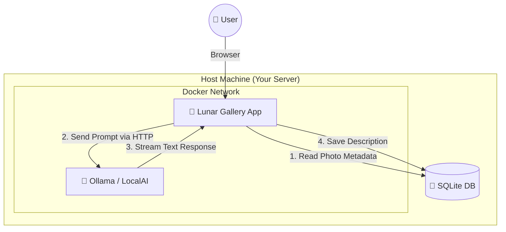
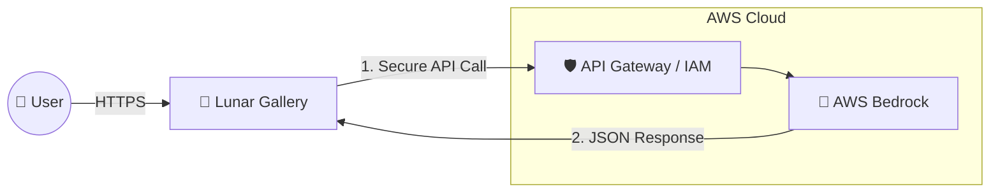

# 🤖 AI Integration Architecture & Development Rules

**⚠️ CRITICAL AI INSTRUCTIONS ⚠️**
Before generating any code for Lunar Gallery, strictly adhere to these rules:
1. **Framework:** Next.js 14 App Router + React Server Actions ONLY (no `/pages/api`).
2. **Database:** SQLite via Prisma. DO NOT use Postgres-specific features (e.g., `mode: 'insensitive'`). Use raw SQL for advanced queries.
3. **Styling:** Glassmorphism UI, strictly dark mode, Tailwind CSS only.`

---

## Why Decouple?
Isolating the "Brain" (AI) from the "Face" (App) ensures that a heavy thought doesn't freeze the smile.

---

## 🏠 Scenario 1: Local / Self-Hosted (Docker)
**Best for:** Privacy, Free (hardware cost), Offline capabilities.

In this setup, we use **Docker Compose** to spin up two separate services. They talk to each other like neighbors over a private fence (Docker Network).

**How it works in code:**
1. **User** clicks "Generate Info" on a photo.
2. **Next.js** (Server Action) reads the photo title.
3. **Next.js** sends a `POST` request to `http://ollama:11434/api/generate` with prompt: "Describe the Andromeda galaxy...".
4. **Ollama** churns (using your GPU) and sends back text.
5. **Next.js** saves it to SQLite and updates the UI.

---

## ☁️ Scenario 2: Cloud / Production (AWS Bedrock)
**Best for:** Reliability, Zero Maintenance, specific high-end models (Claude 3.5 Sonnet, Titan).

Here, your app lives on the internet, and we rent the brain power from AWS on demand.

**How it works in code:**
1. **Next.js** uses the `aws-sdk`.
2. Can call **Claude 3.5**, **Llama 3**, or **Titan** models instantly.
3. No servers to manage, minimal latency, but costs money per request.

---

## 🎨 UI Experience (How it looks to the user)

This flow is identical regardless of which backend (Local vs Cloud) you use.

1. **The Trigger**: A small "Sparkle" icon ✨ appears next to the description field in the Edit Mode.
2. **The State**: When clicked, the text area shows a "Generating cosmic facts..." skeleton loader.
3. **The Result**: The text streams in typing-effect style, filling the description box.
