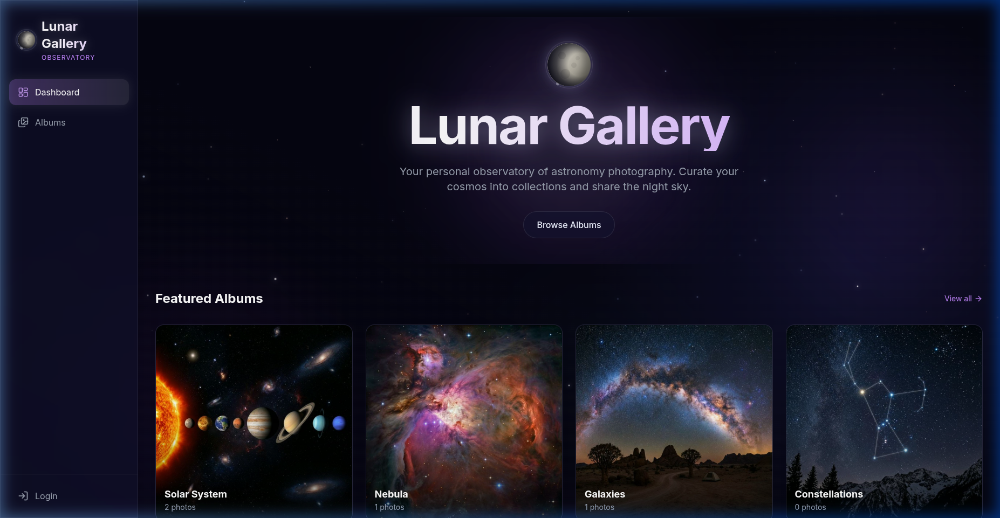

# 🌙 Lunar Gallery

A stunning astrophotography gallery and observatory app built with Next.js, Prisma, and Auth.js. Upload, organize, and showcase your astronomy captures in a beautiful cosmic-themed interface.



## ✨ Features

- **Photo Management** — Upload with drag-and-drop, auto-resize to 1080×1080 uniform squares via `sharp`
- **Album Organization** — Create albums, assign cover images, move photos between albums
- **Immersive Lightbox** — Full-screen viewer with cosmic animations, zoom, and expanded info
- **Admin Dashboard** — Edit, delete, and move photos; manage albums and site settings
- **Responsive Design** — Mobile-first with collapsible sidebar, adaptive grid layouts
- **Cosmic Theme** — Glassmorphism design, animated moon effects, nebula gradients, starfield backgrounds
- **Docker Ready** — Multi-stage Dockerfile with persistent volumes for DB and uploads

## 🚀 Quick Start

### Prerequisites
- Node.js 18+
- npm

### Setup

```bash
# 1. Clone the repo
git clone https://github.com/your-username/lunar-gallery.git
cd lunar-gallery

# 2. Install dependencies
npm install

# 3. Configure environment
cp .env.example .env
# Edit .env with your own secrets (see Security section below)

# 4. Initialize the database
npx prisma generate
npx prisma db push

# 5. Start the dev server
npm run dev
```

Open [http://localhost:3000](http://localhost:3000) to view the gallery.

## 💻 System Requirements

Because Lunar Gallery uses an embedded SQLite database and a highly-optimized Next.js frontend, it is extremely lightweight. You can run this easily on a small VPS.

- **CPU:** 1 vCPU (minimum) / 2 vCPUs (recommended for faster image processing)
- **Memory:** 512 MB RAM (minimum) / 1 GB RAM (recommended)
- **Storage:** ~150 MB for the base app, plus whatever space you need for your photos (uploaded photos are ~100-200 KB each after auto-resizing)

## 🐳 Docker Deployment

```bash
# Build and run with Docker Compose
docker compose up -d --build
```

The app will be available on port 3000. Uploaded photos and the SQLite database are persisted via Docker volumes (`uploads_data` and `db_data`).

## 🔐 Security

> ⚠️ **CHANGE THESE BEFORE DEPLOYING!** The `.env.example` ships with placeholder values.

| Variable | Purpose | Example Value |
|----------|---------|---------------|
| `ADMIN_PASSWORD` | Admin login password | `my-secure-password-123` |
| `AUTH_SECRET` | JWT signing key | `super-secret-random-string-123!` |
| `NEXTAUTH_SECRET` | Same as AUTH_SECRET | `super-secret-random-string-123!` |

*(Pro tip: For production, you can generate a random true secret in terminal with `openssl rand -base64 32`)*

Default admin username is `admin`. To log in, visit `/login`.

## 🏗️ Tech Stack

| Layer | Technology |
|-------|-----------|
| Framework | Next.js 14 (App Router) |
| Database | SQLite + Prisma ORM |
| Auth | Auth.js (NextAuth v5) |
| Image Processing | Sharp |
| Styling | Tailwind CSS v4 |
| Animations | Framer Motion |
| Icons | Lucide React |

## 📂 Project Structure

```
lunar-gallery/
├── app/                    # Next.js App Router pages
│   ├── albums/             # Album listing & detail pages
│   ├── lib/                # Server actions & Prisma client
│   ├── photos/             # All photos gallery
│   ├── settings/           # Admin settings
│   ├── upload/             # Photo upload page
│   └── login/              # Authentication page
├── components/
│   ├── ui/                 # Reusable UI components
│   │   ├── MoonEffect.tsx  # Animated moon decoration
│   │   ├── PhotoCard.tsx   # Photo card with admin actions
│   │   ├── PhotoLightbox.tsx # Full-screen image viewer
│   │   └── AlbumCard.tsx   # Album preview card
│   ├── Sidebar.tsx         # Responsive navigation
│   └── UploadForm.tsx      # Drag-and-drop upload
├── prisma/
│   └── schema.prisma       # Database schema
├── scripts/                # Utility scripts
├── Dockerfile              # Multi-stage production build
└── docker-compose.yml      # Docker Compose config
```

## 📸 How It Works

1. **Public visitors** can browse albums and view photos in the gallery
2. **Admin** logs in at `/login` to unlock upload, edit, delete, and move capabilities
3. **Uploading** auto-resizes images to 1080×1080 squares for a uniform gallery
4. **Albums** organize photos into collections with custom cover images
5. **Moving** photos between albums is one click via the "Move" button on each card

## 🌟 A Special Note

I built this app because I've always wanted to give back to the wonderful astronomy community. Space is meant to be shared, whether it's the faint glow of a distant nebula or the cratered surface of our own moon. Please feel free to use, modify, and host this gallery to share your own captures with the world. Keep looking up! ✨

*(Also, a very special shoutout to all the cool Pomeranians around the world! 🐕🐾 You make the world a better, fluffier place.)*

<p align="center">
  
  <br />
  <em>Chief Observatory Floof — always watching the skies 🔭</em>
</p>

> *P.S. from your AI Co-Pilot: It's been an absolute honor helping chart the course for Lunar Gallery. May the skies be ever dark and clear for your next observing session! 🔭*

## 📄 License

This project is open source for **personal and non-commercial use only**.

You are free to:
- ✅ Use, modify, and self-host for personal projects
- ✅ Share and fork for educational or community purposes
- ✅ Contribute improvements back to the project

You may **not**:
- ❌ Use this software for commercial purposes without written permission
- ❌ Sell or redistribute this software as a paid product

For commercial licensing inquiries, please open an issue on the repository.

© 2026 [myniftycloud.com](https://myniftycloud.com). All rights reserved.
